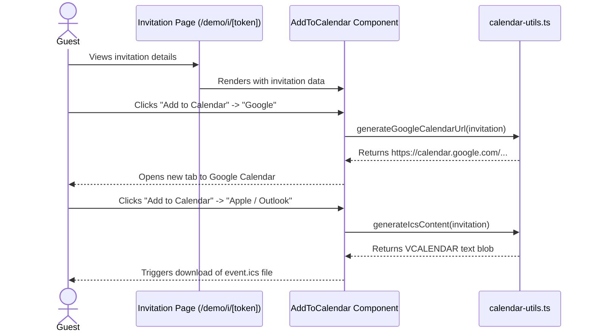

# Feature Ticket: Add to Calendar Links

## Status
pending-implementation

## Context
When guests receive an invitation link (e.g., via `/demo/i/[token]`), they can see the event details and RSVP. However, there is no easy way for them to save the event directly to their personal calendar (Apple, Google, Outlook, etc.). Guests currently have to manually copy the event date, time, and location into their calendar app, which is a common source of friction and can lead to missed events or no-shows.

## Objective
Provide guests with an "Add to Calendar" dropdown or button group on the public invitation page. This allows them to download an `.ics` file (for Apple Calendar, Outlook Desktop, and Android apps) or open a direct link to Google Calendar/Yahoo Calendar, pre-filled with the event's title, date, time, and location.

## Scope
- In scope:
  - Create a new utility file (e.g., `src/lib/calendar-utils.ts`) to generate `.ics` file contents and standard calendar URLs based on the invitation data.
  - Create a reusable client component (e.g., `src/components/add-to-calendar.tsx`) that renders a dropdown or button group with options for Google, Apple/Outlook (.ics), and Yahoo.
  - Add this component to the public invitation page (`src/app/demo/i/[token]/page.tsx` and the real equivalent `src/app/invite/[token]/page.tsx`) near the event details or RSVP section.
- Out of scope:
  - Backend API changes or new database fields.
  - Sending automated calendar invites via email or tracking if a user clicked "Add to Calendar".
  - Complex timezone conversions beyond the host's implicitly provided local time in the event details.

## UX & Entry Points
- Primary entry: The public invitation page (e.g., `/demo/i/[token]`), positioned near the Date, Time, and Location block or the main RSVP call-to-action.
- Components to touch:
  - `src/app/demo/i/[token]/page.tsx` (for the demo sandbox)
  - `src/app/invite/[token]/page.tsx` (for the production flow, if it exists)
  - New files: `src/components/add-to-calendar.tsx` and `src/lib/calendar-utils.ts`
- UX notes: The component should visually match the existing UI (Tailwind classes). A dropdown button titled "Add to Calendar" that reveals a small menu (Google, Apple/Outlook, Yahoo) is a standard pattern that takes up minimal space. Palette will refine the exact hover states and dropdown behavior.

## Tech Plan
- Data sources / utils:
  - Existing `invitation` object passed to the page, containing `title`, `event_date`, `event_time`, `location`, and `organizer_notes`.
  - A new utility function `generateIcsContent(invitation)` that creates a standard VCALENDAR text blob.
  - A new utility function `generateGoogleCalendarUrl(invitation)` that creates a URL like `https://calendar.google.com/calendar/render?action=TEMPLATE&text=...`.
- Files to modify / add:
  - `src/lib/calendar-utils.ts` (new)
  - `src/components/add-to-calendar.tsx` (new)
  - `src/app/demo/i/[token]/page.tsx` (modify to import and render the component)
  - `src/app/invite/[token]/page.tsx` (modify to import and render the component)
- Risks / constraints:
  - **Date Parsing:** `event_date` and `event_time` are stored as separate strings. The calendar utilities need to handle parsing these safely, assuming the event time is in the user's local timezone (or UTC if unspecified) to prevent off-by-one errors in calendar apps.
  - **Client-Side Only:** Generating the `.ics` file and triggering the download must happen on the client. The new `add-to-calendar.tsx` component should have `"use client"`.

## Sequence Diagram (High-Level)

## Acceptance Criteria
- [ ] A guest viewing an invitation sees an "Add to Calendar" option.
- [ ] Clicking the Google option opens a new tab to Google Calendar with the title, date, time, and location correctly pre-filled.
- [ ] Clicking the Apple/Outlook option triggers a download of an `.ics` file that successfully imports into standard calendar applications with the correct details.
- [ ] The component gracefully handles missing optional fields (like `event_time` or `location`).
- [ ] The feature works coherently in the `/demo` flows without requiring authentication.
- [ ] Unit tests are added for `calendar-utils.ts` to ensure correct URL generation and date parsing.