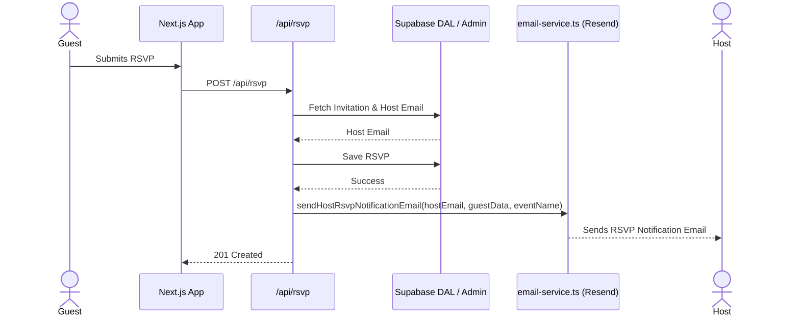

# Feature Ticket: Host Notification on New RSVP

## Status
pending-implementation

## Context
When guests RSVP to an event through the public invitation link, their response is recorded in the database, but the event host is not actively notified. Hosts currently have to repeatedly log in and manually check their dashboard to see if anyone new has responded. This creates a disconnected experience and forces hosts to actively poll for updates, which is inconvenient, especially for events with rolling RSVPs.

## Objective
Automatically send an email notification to the event host whenever a guest submits a new RSVP. This email should summarize the guest's response (name, response status, and any provided comments) and provide a quick link back to the host's dashboard for full details.

## Scope
- In scope:
  - Add a new function `sendHostRsvpNotificationEmail` to `src/lib/email-service.ts` with dedicated HTML and plain-text templates.
  - Update the RSVP API route (`src/app/api/rsvp/route.ts`) to fetch the host's email address using the `user_id` linked to the invitation.
  - Call the new email function asynchronously after successfully recording an RSVP.
- Out of scope:
  - Providing an opt-out mechanism or preference panel for hosts to turn these emails off (to keep scope small; we assume all hosts want this initially).
  - Batching multiple RSVPs into a single digest email (emails will be sent per individual RSVP).
  - Notifying hosts on RSVP updates/changes (only on new RSVPs).

## UX & Entry Points
- Primary entry: Guest submitting an RSVP on the public invite page (`/invite/[token]`).
- Components to touch:
  - `src/lib/email-service.ts`
  - `src/app/api/rsvp/route.ts`
- UX notes: The guest experience is entirely unchanged. The host experience is purely passive; they receive a well-formatted email in their inbox (the one associated with their Google account) containing the RSVP details.

## Tech Plan
- Data sources / utils:
  - Inside `src/app/api/rsvp/route.ts`, after fetching the invitation to validate `invitation_id`, we also need to fetch the host's email. Since the `invitations` table has a `user_id` and the `users` table has an `email`, we need to query the `users` table or perform a join when fetching the invitation.
  - Create `generateHostNotificationEmailHTML` and `generateHostNotificationEmailText` templates in `src/lib/email-service.ts`.
- Files to modify / add:
  - `src/lib/email-service.ts` (add email sending logic and templates).
  - `src/app/api/rsvp/route.ts` (query host details and trigger email asynchronously).
- Risks / constraints:
  - **Latency:** Sending the email synchronously could delay the HTTP response to the guest. The Resend API call should be fast, but ideally executed in the background (e.g., using `Promise.allSettled` or just not awaiting the final email send, though Vercel serverless might kill unawaited promises. Awaiting it is acceptable for now if kept simple).
  - **Data Access:** The unauthenticated guest RSVP flow reads the invitation. To get the host's email, the route may need to use the `supabaseAdmin` client (since unauthenticated guests shouldn't normally be able to query full user details of other users via standard client).

## Sequence Diagram (High-Level)

## Acceptance Criteria
- [ ] Submitting a new RSVP successfully triggers an email to the event host's email address.
- [ ] The email contains the guest's name, their response (Yes/No/Maybe), their comment (if any), and the name of the event.
- [ ] The email sending process does not break the existing RSVP flow or return a 500 error to the guest if the email fails to send.
- [ ] The email design is clear, mobile-friendly, and aligns with the application's branding.
