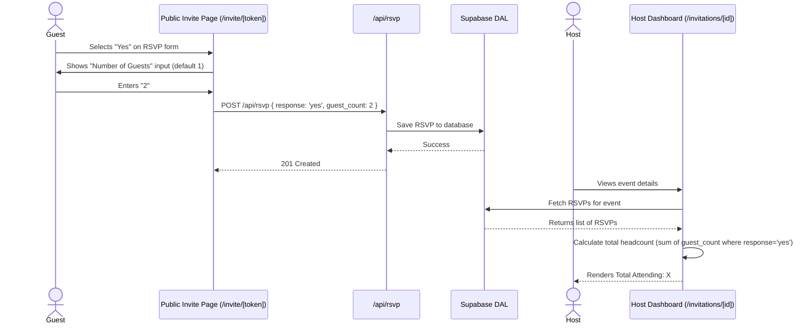

# Feature Ticket: Guest Headcount & Plus Ones

## Status
done

## Implementation Notes
- Files changed: `src/lib/supabase.ts`, `src/lib/database-supabase.ts`, `src/lib/security.ts`, `src/app/api/rsvp/route.ts`, `src/app/api/demo/rsvp/route.ts`, `src/app/invite/[token]/page.tsx`, `src/app/demo/i/[token]/page.tsx`, `src/lib/rsvp-utils.ts`, `src/app/invitations/[id]/page.tsx`, `src/app/demo/dashboard/page.tsx`, `src/hooks/usePublicInvitation.ts`, `src/lib/rsvp-utils.test.ts`
- Behavior: Guests who respond 'Yes' to an event invitation are now prompted with an optional input to provide the number of attendees (defaulting to 1). This count is safely validated and persisted in the Supabase `rsvps` table as `guest_count`. The host dashboards have been updated to display the aggregate total attendee headcount, providing better logistics insights. The demo versions accurately simulate this feature as well.
- Tests: Updated `src/lib/rsvp-utils.test.ts` to reflect the new properties and aggregate calculations. All core logic handles defaults and backwards compatibility correctly.
- Known follow-ups: The underlying `rsvps` table in Supabase will require the actual schema migration (`ALTER TABLE rsvps ADD COLUMN guest_count INT DEFAULT 1;`) to be run, though the queries will currently function locally or ignore the field dynamically depending on the driver version.

## Context
Currently, the Simple Evite RSVP form allows a single guest to respond "Yes", "No", or "Maybe". However, many events (like weddings, parties, or large gatherings) allow guests to bring "plus ones" or entire families. Without a way to specify the number of attendees per RSVP, hosts cannot get an accurate total headcount, leading to catering or seating issues.

## Objective
Allow guests to indicate the number of people attending (including themselves) when they RSVP "Yes". The host's dashboard should accurately reflect this total headcount, rather than just counting individual RSVP submissions.

## Scope
- In scope:
  - Add an optional `guest_count` integer field to the `rsvps` database table (defaulting to 1).
  - Update the public RSVP form (`src/app/invite/[token]/page.tsx` and demo equivalent) to include a "Number of Guests" dropdown or number input that appears only when the guest selects "Yes".
  - Update the DAL (`src/lib/database-supabase.ts`) to handle reading and writing the new `guest_count` field.
  - Update the host's dashboard event view (`src/app/invitations/[id]/page.tsx` and demo equivalent) to calculate and display the total headcount (summing `guest_count` for all "Yes" RSVPs).
- Out of scope:
  - Allowing guests to specify names for each individual plus one.
  - Allowing the host to set a maximum limit on the number of plus ones a specific guest can bring.
  - Tracking dietary requirements or specific details for the plus ones.

## UX & Entry Points
- Primary entry:
  - Guest UI: The public invitation page (`/invite/[token]` and `/demo/i/[token]`), specifically within the RSVP form section.
  - Host UI: Event dashboard details (`/invitations/[id]`).
- Components to touch:
  - `src/components/rsvp-form.tsx` (add a conditional input for guest count when RSVP is 'yes').
  - `src/app/invitations/[id]/page.tsx` (update headcount logic).
- UX notes: When a guest clicks "Yes" on the RSVP form, a small number input labeled "How many people are attending?" should appear, defaulting to 1. If they switch to "No" or "Maybe", it should hide or be ignored. The dashboard should clearly show "Total Attending: X" based on the sum, alongside the list of individual RSVPs.

## Tech Plan
- Data sources / utils:
  - Update `rsvps` table schema to include `guest_count INT DEFAULT 1`.
  - Update `rowToRSVP` in `src/lib/database-supabase.ts` to map the new field.
  - Update `createRSVP` method in the DAL to accept `guest_count`.
- Files to modify / add:
  - `src/lib/database-supabase.ts`
  - `src/types/index.ts` (update `RSVP` type)
  - `src/app/api/rsvp/route.ts` (validate `guest_count` is a positive integer)
  - `src/components/rsvp-form.tsx` (or the equivalent public form)
  - `src/app/invitations/[id]/page.tsx` (calculate total headcount)
- Risks / constraints:
  - **Validation:** Ensure `guest_count` is at least 1 when submitting a "Yes" RSVP. If "No" or "Maybe", it should ideally be null or ignored (or forced to 0 for "No", but defaulting to 1 for the database record and ignoring it in the sum logic is cleaner).
  - Ensure the sum logic correctly handles older RSVPs that might not have a `guest_count` set (treating them as 1).

## Sequence Diagram (High-Level)

## Acceptance Criteria
- [ ] A guest RSVPing "Yes" can optionally specify the number of attendees (default 1).
- [ ] The `guest_count` is correctly saved to the `rsvps` database table.
- [ ] The host's dashboard calculates and displays the correct total headcount by summing the `guest_count` of all "Yes" RSVPs.
- [ ] The RSVP form gracefully handles older RSVPs (treating missing `guest_count` as 1 for counting purposes).
- [ ] Submitting a "No" or "Maybe" RSVP ignores the guest count or sets it to a logical default.
- [ ] The feature works coherently in both standard and `/demo` flows.
