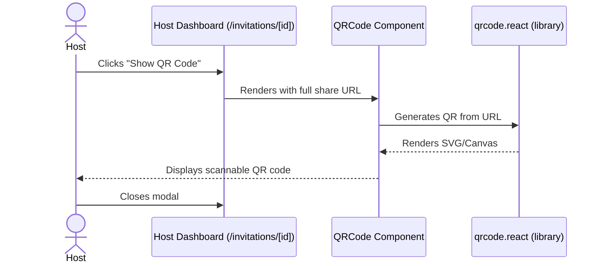

# Feature Ticket: QR Code Generator for Invites

## Status
pending-implementation

## Context
Simple Evite relies heavily on link-based access to share invitations. Currently, hosts must copy a URL and send it to guests digitally via SMS, email, or a messaging app. For in-person events (like a physical save-the-date card) or situations where a host wants to quickly display a link on their phone for others to scan, typing out a long URL is impractical.

## Objective
Provide a fast and easy way for hosts to generate a scannable QR code of their unique invitation link. This QR code can be saved, printed, or displayed on-screen, allowing guests to simply scan it with their phone's camera to access the RSVP page.

## Scope
- In scope:
  - Add a "Show QR Code" button to the host's event dashboard and the "Share" modal/section (`src/app/invitations/[id]/page.tsx` and demo equivalent).
  - Create a new reusable client component (`src/components/qr-code.tsx`) that renders a QR code based on the provided URL.
  - Integrate a lightweight client-side QR code generation library (like `qrcode.react`) to render the `share_token` URL directly in the browser.
- Out of scope:
  - Backend generation of QR codes or storing them as images in the database.
  - Customizing the QR code's color or adding logos (keep it a simple black-and-white code).
  - Generating print-ready PDFs of the QR code.

## UX & Entry Points
- Primary entry:
  - Host UI: The event dashboard details (`/invitations/[id]`), near the existing "Copy Link" or "Share" functionality.
- Components to touch:
  - `src/components/share-link.tsx` (or similar component managing the share actions).
  - New component: `src/components/qr-code.tsx`.
- UX notes: A small "QR" button or icon next to the "Copy Link" button should open a simple modal displaying the QR code. The modal should include a brief instruction ("Scan to RSVP") and a button to close it. The QR code should be rendered client-side.

## Tech Plan
- Data sources / utils:
  - Use the existing `share_token` and the application's base URL to construct the full link.
  - Install a client-side library like `qrcode.react` (ensure it fits within the `npm install` restrictions or is compatible with the project).
- Files to modify / add:
  - `src/components/qr-code.tsx` (new component rendering the QR code)
  - `src/components/share-invitation.tsx` (or whatever component holds the share link)
  - `package.json` (add `qrcode.react` dependency if needed)
- Risks / constraints:
  - Ensure the QR code generator works entirely offline on the client side without needing a backend API to generate images. This is faster and simpler to implement.

## Sequence Diagram (High-Level)

## Acceptance Criteria
- [ ] The event dashboard includes a "Show QR Code" option near the "Copy Link" section.
- [ ] Clicking the option opens a modal or section displaying a clean, scannable QR code.
- [ ] Scanning the QR code with a phone camera correctly navigates to the public invitation page (`/invite/[token]`).
- [ ] The feature works coherently in both standard and `/demo` flows.
- [ ] The QR code is generated entirely client-side without relying on external APIs for image generation.
