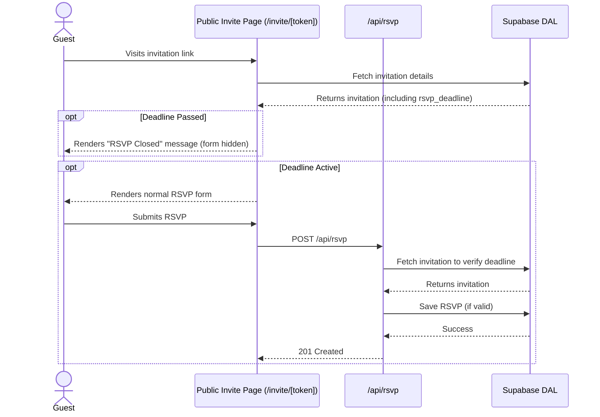

# Feature Ticket: RSVP Deadline

## Status
pending-implementation

## Context
Currently, event hosts on Simple Evite cannot set a firm cutoff date for responses. Guests can continue to submit RSVPs indefinitely. This creates uncertainty for hosts who need to finalize headcounts for catering, seating arrangements, or venue bookings by a specific date.

## Objective
Allow hosts to optionally set an "RSVP Deadline" date when creating or editing an event. When the current date is past the RSVP deadline, the public invitation page should clearly indicate that RSVPs are closed and disable the submission form, preventing any late responses.

## Scope
- In scope:
  - Add an optional `rsvp_deadline` date field to the `invitations` database table.
  - Update the "Create Invitation" and "Edit Invitation" UI forms (`src/app/create/page.tsx`, `src/app/invitations/[id]/page.tsx`) to include a date picker for the RSVP deadline.
  - Update the DAL (`src/lib/database-supabase.ts`) to handle reading and writing the new `rsvp_deadline` field.
  - On the public invitation page (`src/app/invite/[token]/page.tsx` and the demo equivalent), check if the current date is past the `rsvp_deadline`. If so, hide/disable the RSVP form and display a clear "RSVP Closed" message.
  - Ensure the API route `src/app/api/rsvp/route.ts` rejects new RSVPs if the deadline has passed.
- Out of scope:
  - Automated reminder emails to guests approaching the deadline.
  - Complex timezone handling beyond the host's implicitly provided local date.
  - Allowing the host to manually "re-open" RSVPs beyond changing the date.

## UX & Entry Points
- Primary entry:
  - Host UI: "Create Invitation" and "Edit Invitation" forms.
  - Guest UI: The public invitation page (`/invite/[token]` and `/demo/i/[token]`).
- Components to touch:
  - `src/components/rsvp-form.tsx` (or wherever the form is rendered on the public page).
  - `src/components/invitation-form.tsx` (or the equivalent host form components).
- UX notes: On the public page, if the deadline has passed, the standard RSVP form should be replaced or overlaid with a distinct UI element (e.g., a grayed-out box with "RSVPs are now closed for this event"). The date input on the host side should match the styling of the existing event date picker.

## Tech Plan
- Data sources / utils:
  - Add `rsvp_deadline` (timestamp/date) to `database-schema.sql` (and write a migration instruction or rely on Atlas to add it if necessary, though ideally it should be explicitly handled in the schema).
  - Update `rowToInvitation` in `src/lib/database-supabase.ts` to map the new field.
  - Update `createInvitation` and `updateInvitation` DAL methods to accept the new field.
- Files to modify / add:
  - `src/lib/database-supabase.ts`
  - `src/types/index.ts` (or wherever the `Invitation` type is defined)
  - `src/app/api/rsvp/route.ts` (add backend validation)
  - `src/app/create/page.tsx` (and/or relevant form components)
  - `src/app/invitations/[id]/page.tsx`
  - `src/app/invite/[token]/page.tsx` & `src/app/demo/i/[token]/page.tsx`
- Risks / constraints:
  - Timezone comparison: Ensure the comparison between "now" and the `rsvp_deadline` uses a consistent approach (e.g., comparing UTC timestamps or simple date strings).
  - Sentinel constraint: Adding a backend validation check in `/api/rsvp` is essential so that users cannot bypass the UI and submit an RSVP after the deadline via direct API requests.

## Sequence Diagram (High-Level)

## Acceptance Criteria
- [ ] A host can set an optional RSVP Deadline when creating or editing an event.
- [ ] The `rsvp_deadline` is correctly saved to and retrieved from the database.
- [ ] If an event has an RSVP deadline that is in the past, a guest visiting the public invite page sees an "RSVP Closed" message and cannot submit the form.
- [ ] Direct POST requests to `/api/rsvp` for an event with an expired deadline are rejected.
- [ ] If no deadline is set, or the deadline is in the future, the RSVP flow works as normal.
- [ ] The feature works in both standard and `/demo` environments.
