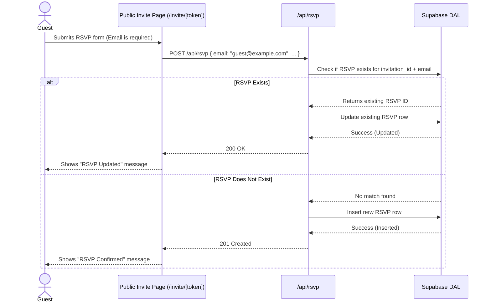

# Feature Ticket: Editable RSVPs via Mandatory Email

## Status
done

## Context
Currently, the Simple Evite RSVP form allows guests to respond quickly using a public invitation link without creating an account. However, if a guest needs to change their RSVP status later (e.g., they initially said "Yes" but can no longer attend), they have no way to update their original response, especially across different devices. If they submit the form again, it creates a duplicate entry, confusing the host's headcount.

## Objective
Enable guests to seamlessly update their existing RSVP from any device by making the email field mandatory and using it as a unique identifier. Submitting the RSVP form again with the same email address will update the existing response instead of creating a duplicate.

## Scope
- In scope:
  - Update the `RSVP` schema and form (`src/components/rsvp-form.tsx`) to make the `email` field mandatory.
  - Add helper text to the public RSVP form explaining that using the same email allows future updates.
  - Modify the backend `/api/rsvp/route.ts` to perform an upsert (update if exists, insert if new) based on the combination of `invitation_id` and `email`.
  - Update the database access layer (`src/lib/database-supabase.ts`) to support this upsert logic cleanly.
- Out of scope:
  - Magic links or OTP verification flows.
  - Allowing guests to change the email address associated with their RSVP after the fact.
  - Complex UI state to proactively load previous responses before submission (keep it a simple "submit to overwrite" flow).

## UX & Entry Points
- Primary entry:
  - Guest UI: The public invitation page (`/invite/[token]` and `/demo/i/[token]`), specifically within the RSVP form section.
- Components to touch:
  - `src/components/rsvp-form.tsx` (or the equivalent public form component).
- UX notes:
  - The email field must show standard validation (required, valid email format).
  - Add subtle helper text below the email field or submit button: "We use your email to let you update your RSVP later."
  - When a guest submits an update, the success state should clearly communicate the update (e.g., "Your RSVP has been updated!").

## Tech Plan
- Data sources / utils:
  - Ensure `src/lib/security.ts` (`validateRSVPData` or equivalent schema) is updated to require the `email` field.
  - Update `createRSVP` in `src/lib/database-supabase.ts` (or add an `upsertRSVP` method) to handle the upsert. Supabase's `.upsert()` method requires a unique constraint. If a unique constraint on `(invitation_id, email)` doesn't exist, Atlas will need to implement the upsert manually via a SELECT followed by UPDATE or INSERT to avoid touching database schema migrations directly, OR update the schema if that's standard procedure for the repo. The safer approach is manual check-then-update in the DAL.
- Files to modify / add:
  - `src/lib/database-supabase.ts`
  - `src/lib/security.ts` (validation schemas)
  - `src/app/api/rsvp/route.ts`
  - `src/components/rsvp-form.tsx`
- Risks / constraints:
  - **Security (Sentinel):** Ensure the manual "check-then-update" logic in the DAL accurately targets the correct `invitation_id` so guests cannot overwrite RSVPs on other invitations.
  - **Demo Mode:** Ensure the demo store (`src/lib/demo/demo-store.ts`) is also updated to handle this upsert logic for the `/api/demo/rsvp` route.

## Sequence Diagram (High-Level)

## Acceptance Criteria
- [ ] The `email` field on the public RSVP form is mandatory.
- [ ] The API validation schema enforces that `email` is present and valid.
- [ ] Submitting an RSVP with an email that has not been used for that specific invitation creates a new RSVP.
- [ ] Submitting an RSVP with an email that *has* already been used for that specific invitation updates the existing RSVP record instead of creating a duplicate.
- [ ] The guest sees appropriate success feedback whether it was a new submission or an update.
- [ ] The feature works coherently in both standard and `/demo` environments.

## Implementation Notes
- Files changed: `src/lib/database-supabase.ts`, `src/lib/security.ts`, `src/lib/form-utils.ts`, `src/app/api/rsvp/route.ts`, `src/app/api/demo/rsvp/route.ts`, `src/app/invite/[token]/page.tsx`, `src/app/demo/i/[token]/page.tsx`, `src/hooks/usePublicInvitation.ts`
- Behavior:
  - The email field is now mandatory for all RSVPs (both in demo mode and live application).
  - Submitting an RSVP with an email that already exists for a given invitation updates the existing record instead of creating a duplicate.
  - The frontend dynamically displays "Your RSVP has been updated!" if the submission was an update, and "Your RSVP has been confirmed!" if it was a new submission.
- Tests: Verified frontend with Playwright tests locally and successfully executed all project tests via `npm run test`.
