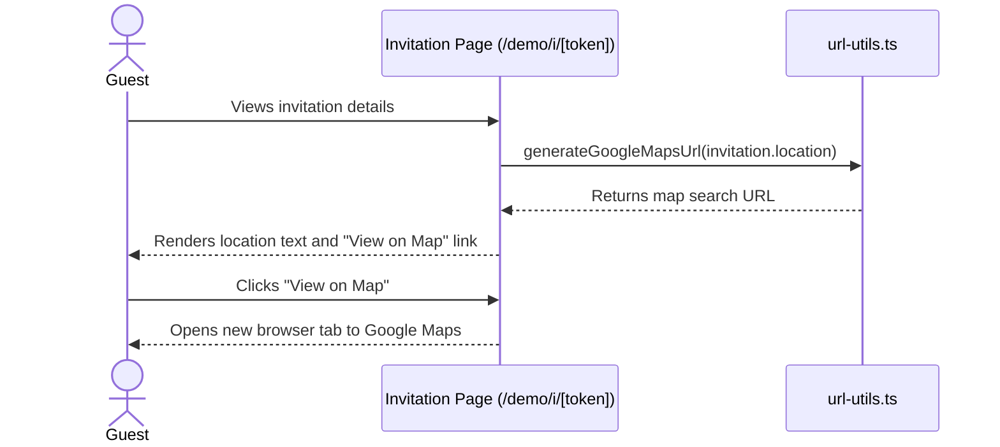

# Feature Ticket: "View on Map" Link for Event Location

## Status
done

## Context
When guests receive an invitation link (e.g., via `/demo/i/[token]`), they see the event location as plain text. To find out where the event is or how to get there, guests must manually highlight, copy, and paste the text into their preferred map application. This adds friction to the user experience, especially on mobile devices.

## Objective
Provide guests with a convenient "View on Map" link directly next to or below the event location on the public invitation page. This link will open a new tab with a Google Maps search for the location, saving guests the hassle of copy-pasting.

## Scope
- In scope:
  - Create a utility function (e.g., `generateGoogleMapsUrl(location)`) in a new or existing utility file (like `src/lib/url-utils.ts` or `src/lib/calendar-utils.ts`).
  - Update the public invitation pages (`src/app/invite/[token]/page.tsx` and `src/app/demo/i/[token]/page.tsx`) to conditionally render a "View on Map" link if the `location` field exists.
  - The link should open in a new tab (`target="_blank"`, `rel="noopener noreferrer"`).
- Out of scope:
  - Embedding interactive map components (e.g., Google Maps iframe).
  - Geocoding or validating the address on the backend.
  - Support for mapping providers other than Google Maps (keep it simple).

## UX & Entry Points
- Primary entry: The public invitation page (`/invite/[token]` and `/demo/i/[token]`), inside the event details section where the Location is displayed.
- Components to touch:
  - `src/app/invite/[token]/page.tsx`
  - `src/app/demo/i/[token]/page.tsx`
  - A utility file (e.g., `src/lib/url-utils.ts`)
- UX notes:
  - The "View on Map" link should be visually distinct but unobtrusive, perhaps a smaller text link with an external link icon, styled with Tailwind classes (e.g., `text-blue-600 hover:underline text-sm inline-flex items-center gap-1 mt-1`).
  - It should appear directly below the plain text location.

## Tech Plan
- Data sources / utils:
  - The existing `invitation.location` string.
  - A new utility function `generateGoogleMapsUrl(location: string): string` that returns `https://www.google.com/maps/search/?api=1&query=${encodeURIComponent(location)}`.
- Files to modify / add:
  - `src/lib/url-utils.ts` (add utility function)
  - `src/app/invite/[token]/page.tsx` (add link UI)
  - `src/app/demo/i/[token]/page.tsx` (add link UI)
- Risks / constraints:
  - **Data Privacy:** We are sending user-provided location strings to Google via URL query parameters, which is standard behavior for external map links, but we shouldn't send anything else.
  - **Empty Locations:** The link should only render if `invitation.location` is truthy and non-empty.

## Sequence Diagram (High-Level)

## Acceptance Criteria
- [ ] A guest viewing an invitation with a specified location sees a "View on Map" link next to or below the location text.
- [ ] Clicking the link opens a new tab directed to Google Maps with the location pre-filled in the search query.
- [ ] The link does not appear if the invitation has no location specified.
- [ ] The feature works coherently in both the `/demo` flows and live flows without requiring authentication.
- [ ] The `generateGoogleMapsUrl` utility correctly encodes special characters in the location string.
