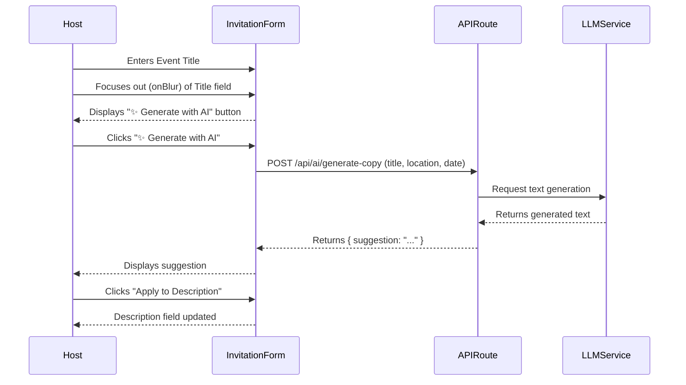

# Ticket: Smart Invite Copy

## Status
`pending-implementation`

## Context
Simple Evite helps hosts create invitations quickly, but writing catchy, context-appropriate event descriptions can be time-consuming. Hosts often stare at a blank "Description" field, unsure of what to write or how to set the right tone.

## Objective
Provide an AI-powered "Smart Copy" feature that generates suggested invitation text based on the event title and basic details, helping hosts overcome writer's block and create engaging invites faster.

## Scope
- Reorder the fields in the Invitation Form (`src/components/invitation-form.tsx`) by moving the Description field below the Event Date, Time, and Location fields. This ensures the host fills out those contextual details first, providing a richer prompt for the LLM.
- Add a conditionally rendered "✨ Generate with AI" button next to the relocated Description field.
- Create a new API route (`/api/ai/generate-copy`) that accepts the event title, date, time, and location to generate suggested descriptions.
- The feature is strictly opt-in and provides editable text suggestions; it does not auto-save or override user input without consent.
- Uses a lightweight LLM API (e.g., OpenAI or similar, assuming a generic AI utility is available or can be mocked if necessary for demo purposes, or we can use a built-in mock for the demo environment).

## UX & Entry Points
- **Invitation Form (`src/components/invitation-form.tsx`)**: First, the form layout is updated so that Date, Time, and Location precede the Description. A small sparkle icon button is displayed near the Description textarea *only* after the user has entered an Event Title and focuses out (onBlur) of the title field. Because of the reordered fields, when the host reaches the Description field and clicks the generate button, the AI can utilize the naturally filled-in title, location, date, and time as rich context, bypassing any need for a manual tone popover. The generated text is then displayed and can be applied to the description field.

## Tech Plan
1. **API Route**: Create `src/app/api/ai/generate-copy/route.ts`.
   - Method: POST
   - Input: `{ title, location, date, time }`
   - Action: Calls an external LLM API (or a mock service for local/demo) to generate a short, engaging event description based on the provided event details.
   - Output: `{ suggestions: string[] }` or a single string.
2. **Component Update**: Modify `src/components/invitation-form.tsx`.
   - Reorder the form layout (move Description below Location).
   - Add state to track if the title field has been blurred (e.g., `hasTitleBlurred`).
   - Add state for the AI generation (loading, result, error).
   - Conditionally render the "✨ Generate with AI" button next to the description field if `hasTitleBlurred` is true and `formData.title` is not empty.
   - Fetch from `/api/ai/generate-copy` using current `formData` (title, location, event_date, event_time) when triggered.
3. **Demo Fallback**: Ensure the API route returns sensible mock data if the environment variable for the LLM is missing, so `/demo` users can still experience the UI flow.

## Sequence Diagram

## Acceptance Criteria
- [ ] The "Generate with AI" button is ONLY visible near the Description field after a user enters a title and focuses out of the title input.
- [ ] Clicking the button requests AI text using the current form state (title, etc.) without requiring a popover.
- [ ] The generated text can be easily applied to the Description field.
- [ ] The feature fails gracefully (shows an error or uses a mock) if the AI service is unavailable.
- [ ] No database schema changes are required.
- [ ] The feature works in the `/demo` environment.