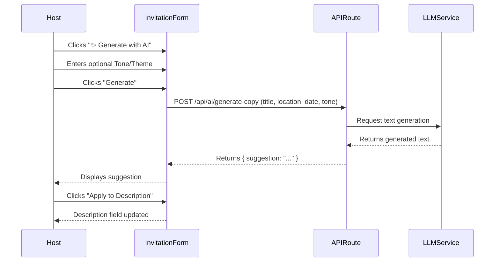

# Ticket: Smart Invite Copy

## Status
`pending-implementation`

## Context
Simple Evite helps hosts create invitations quickly, but writing catchy, context-appropriate event descriptions can be time-consuming. Hosts often stare at a blank "Description" field, unsure of what to write or how to set the right tone.

## Objective
Provide an AI-powered "Smart Copy" feature that generates suggested invitation text based on the event title and basic details, helping hosts overcome writer's block and create engaging invites faster.

## Scope
- Add a "✨ Generate with AI" button next to the Description field in the Invitation Form (`src/components/invitation-form.tsx`).
- Create a new API route (`/api/ai/generate-copy`) that accepts the event title, date, location, and an optional prompt to generate 1-3 suggested descriptions.
- The feature is strictly opt-in and provides editable text suggestions; it does not auto-save or override user input without consent.
- Uses a lightweight LLM API (e.g., OpenAI or similar, assuming a generic AI utility is available or can be mocked if necessary for demo purposes, or we can use a built-in mock for the demo environment).

## UX & Entry Points
- **Invitation Form (`src/components/invitation-form.tsx`)**: A small sparkle icon button near the Description textarea. Clicking it opens a small popover or modal where the host can optionally add a "Vibe/Theme" (e.g., "Casual BBQ", "Formal Wedding") and hit "Generate". The generated text can then be applied to the description field.

## Tech Plan
1. **API Route**: Create `src/app/api/ai/generate-copy/route.ts`.
   - Method: POST
   - Input: `{ title, location, date, tone }`
   - Action: Calls an external LLM API (or a mock service for local/demo) to generate a short, engaging event description.
   - Output: `{ suggestions: string[] }` or a single string.
2. **Component Update**: Modify `src/components/invitation-form.tsx`.
   - Add state for the AI generation (loading, result, error).
   - Add UI elements (button to trigger, display for results).
   - Fetch from `/api/ai/generate-copy` when triggered.
3. **Demo Fallback**: Ensure the API route returns sensible mock data if the environment variable for the LLM is missing, so `/demo` users can still experience the UI flow.

## Sequence Diagram

## Acceptance Criteria
- [ ] A "Generate with AI" button is visible near the Description field in the create/edit invitation form.
- [ ] Clicking the button allows the user to request AI text based on the current form state (title, etc.).
- [ ] The generated text can be easily applied to the Description field.
- [ ] The feature fails gracefully (shows an error or uses a mock) if the AI service is unavailable.
- [ ] No database schema changes are required.
- [ ] The feature works in the `/demo` environment.